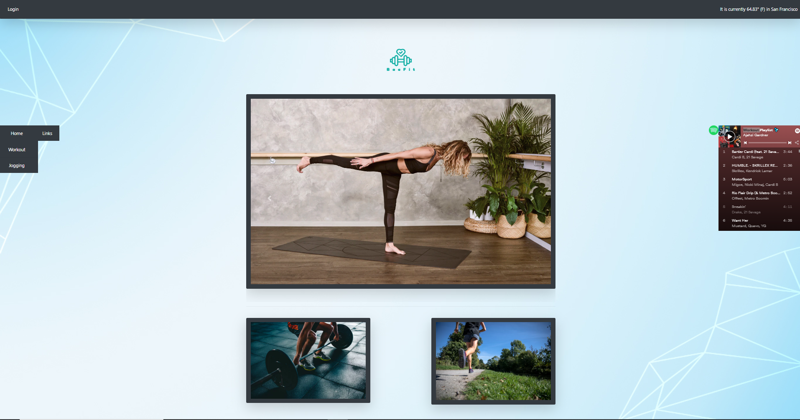
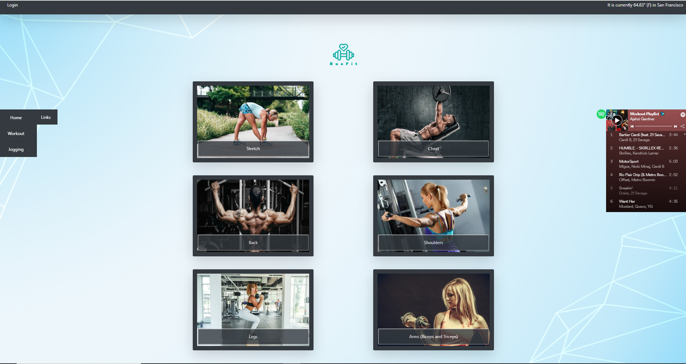
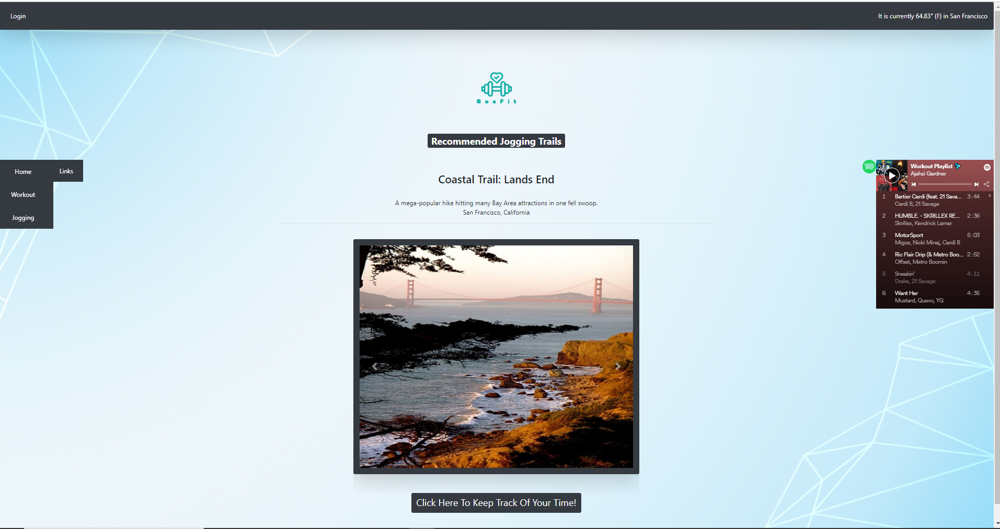

# BaeFit

## Links:
Deployed Website: <br> https://bryanjacinto1994.github.io/Project-One/
<br>
Github Repository: <br> https://github.com/bryanjacinto1994/Project-One
## Images:






## Summary:
A site that combines exercising with other aspects to make it more enjoyable. The workouts are designed for everyone, from beginners to veterans. Trail API finds scenic jogging routes for runners!

### **Highlights:**
- Firebase Authentication
- Trail / Weather API
- Workout guides popup via Modals


## Technologies Used:
- HTML
- Bootstrap/CSS
- Javascript/jQuery
- Firebase
- Weather API
- Trail API
- Git
- GitHub
- VSCode

## Goals:
- Utilize Firebase Database more (initially we planned to store a lot of data in here, but time restraints prevented us from doing so)
- Fully Interface Spotify/Other Music Streaming

## Learning Experience:
- Learned about Spotify SDK
- Learned about Firebase Authentication
- Learned about different APIs
- Gained a lot of debugging experience while merging files
- Learned about github collaboration using merge and different branches.


## Code Snippet:

FireBase:
```javascript
// do something when user auth state changes
firebase.auth().onAuthStateChanged(function(user) {
    // log user info
    if (user) {
        // User is signed in.
        user.getIdToken().then(function(accessToken) {
            // log accesstoken
        });
        // change div to let user know login was successful
        $("#loginui").html("<p>Login was successful!");
        setTimeout(function() {
            $("#exampleModal").modal("hide");
        }, 3000)
        // hide login button and show logout button
        $("#loginBtn").addClass("d-none");
        $("#logoutBtn").removeClass("d-none");
    }
}, function(error) {
    // do something when an error occurs
    console.log(error);
})

// logout button click listener
$("#logoutBtn").on("click", function() {
    // sign out!
    firebase.auth().signOut();
    // show modal
    $("#exampleModal").modal("show");
    $("#loginui").html("You have logged out!")
    // auto hide modal after 3 seconds
    setTimeout(function() {
        // hide modal
        $("#exampleModal").modal("hide");
        $("#logoutBtn").addClass("d-none");
        $("#loginBtn").removeClass("d-none");
        // set timer before changing login modal for fluid transition
        setTimeout(function() {
            // reset the login modal
            $("#loginui").html("");
            setTimeout(function() {
                ui.start('#loginui', uiConfig);
            }, 1000)
            
        }, 2000);
    }, 3000);
})
```
 Functionality of Trail API:
```javascript
function apiCall(startLat, startLong){
        // Query URL that retrieves data using latitude and longitude
        queryURL = "https://www.hikingproject.com/data/get-trails?lat=" + startLat + "&lon=" + startLong + "&maxDistance=10&key=200595352-77e13f2d759dbcd29bbde8b635ba9b65";
            // Querying the base URL to get required response using AJAX method
            $.ajax({
                url : queryURL,
                method : "GET"
            }).then(function(response){
                console.log(response);
                // Iterating through the response array
                for(var i=0; i<7; i++){
                // Creating new div to append images to the html page
                var newDiv = $("<div>");
                // Create active class for first image received as response
                    if(i === 0){
                   newDiv.addClass("carousel-item active");
                    }
                    // Create non active class for rest of images received
                    else{
                    newDiv.addClass("carousel-item");
                    }
                    // Creating new image tag and appending to div
                //    var imgBtn = $("<button>");
                //    imgBtn.attr("id","image" + i)
                   var imageTag = $("");
                   imageTag.attr("id","imgBtn"+i);
                   imageTag.attr("src",response.trails[i].imgMedium);
                   imageTag.attr("style","height: 600px; width: 300px");
                   imageTag.addClass("imageBtn d-block w-100 shadow-lg p-3 mb-5 bg-dark rounded");
                   imageTag.attr("alt",i);
                //    imgBtn.append(imageTag);
                   newDiv.append(imageTag);
                   $("#imgDiv").append(newDiv);
                }
```
Weather API :

```javascript
// declare global variable to store latitude and longitude
var lat,
    lon;

// prompt user for geolocation permission
if (navigator.geolocation) {
    navigator.geolocation.getCurrentPosition(function(position) {
        // set lat and lon
        lat = position.coords.latitude;
        lon = position.coords.longitude;
        weather();
    });
} else {
    console.log("Geolocation not supported in browser!")
}

// call openweathermap for deets!
function weather(){
    var APIKey = "96f902ee5cbadb67440defd501103a74";
    var queryURL = "https://api.openweathermap.org/data/2.5/weather?lat=" + lat + "&lon=" + lon + "&units=imperial&appid=" + APIKey;

$.ajax({
    url: queryURL,
    method: "GET"
})
.then(function(response){
    // append information to navbar
    $("#weather").html("It is currently " + response.main.temp + "° (F) in " + response.name)    
})

}
```

## Author Links: 
### - Bryan Jacinto: <br>
Github: <br> https://github.com/bryanjacinto1994 <br>
Linkedin: <br> https://www.linkedin.com/in/bryan-jacinto-100438aa/
### - Mahisha Gunasekaran: <br>
Github: <br>https://github.com/Mahi-Mani <br>
Linkedin: <br> https://www.linkedin.com/in/mahisha-gunasekaran-0a780a88

### - Kerwin Hy: <br>
Github: <br>https://github.com/seiretsym <br>
Linkedin: <br> https://www.linkedin.com/in/kerwinhy/
